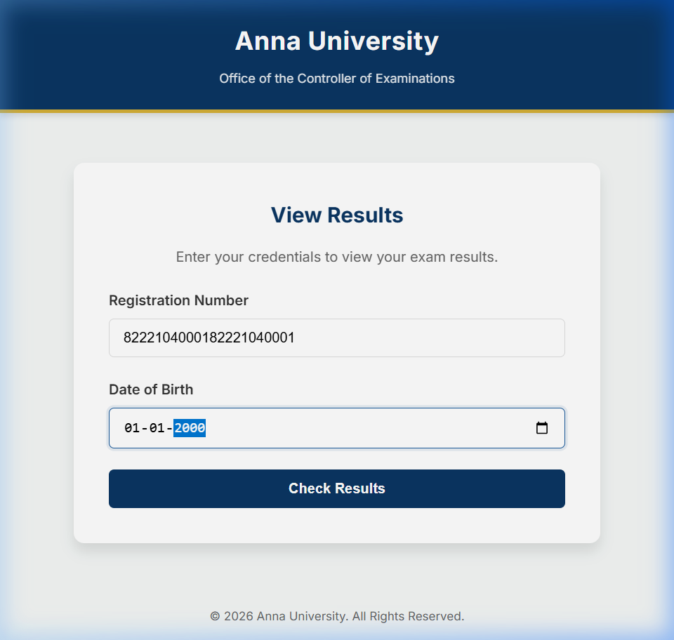
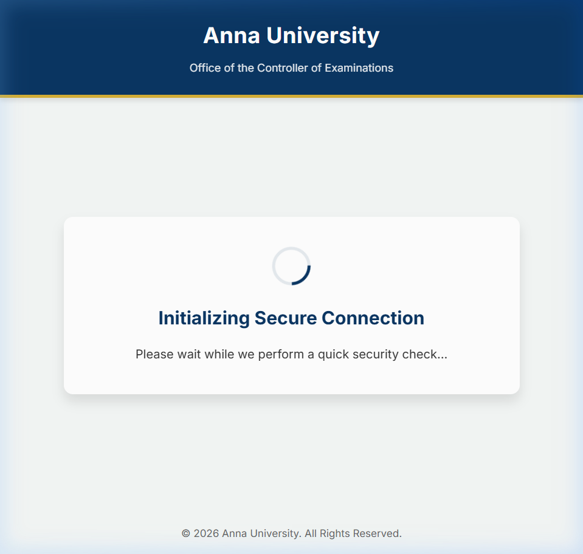

# Anna University Results Portal: The Architecture of Scale

This project is a high-performance, queue-based proof-of-concept designed to solve the infamous **"Results Day Crash"** that plagues Anna University's servers every semester. 

*Disclaimer: This is a personal architectural exploration and is **not affiliated with Anna University**.*

---

## 💥 The Problem: The "Results Day" Bottleneck

Every semester, when Anna University announces results, over **1.5 million students** attempt to check their grades simultaneously. 

The traditional architecture fails due to three fatal flaws:
1. **The Database Bottleneck:** Every student enters their Registration Number and Date of Birth, triggering a live SQL query against the central Oracle database. The database cannot handle 100,000+ concurrent queries and locks up.
2. **The F5 Refresh Attack:** Because the server slows down, students panic and constantly refresh the page (F5). This accidentally creates a massive, self-inflicted Distributed Denial of Service (DDoS) attack.
3. **Automated Scraping Bots:** Third-party websites deploy bots to scrape results as fast as possible, consuming what little bandwidth the university has left.

The result? The portal crashes entirely, students are stressed, and the university's IT infrastructure goes offline for hours.

---

## 🎯 The Solution: How This Architecture Fixes It

This proof-of-concept completely reimagines the architecture, replacing the fragile live-database model with a highly scalable, static-first approach.

### 1. Stopping the Bots (Proof-of-Work CAPTCHA)
Before a user can even ask the server for results, their browser must solve a cryptographic puzzle (Proof-of-Work). This takes a normal browser about 2 seconds, which is invisible to humans. However, a bot trying to make 1,000 requests a second will have its CPU maxed out and crash. **Bots are blocked at the browser level.**

### 2. Eliminating the Refresh Attack (The Waiting Room)
Instead of letting 1.5 million students hit the database at once, users are placed into a **Redis-backed Virtual Waiting Room**. 
- They are given a "Queue Token" and an estimated wait time.
- If they hit refresh, their place in line is saved.
- The system admits students in controlled batches (e.g., 5,000 at a time), ensuring the backend is *never* overwhelmed.

### 3. Killing the Database Bottleneck (Pre-Generated JSON)
The most critical change: **The database is removed entirely from the live flow.**
Before results are announced, a batch script exports the database and pre-generates **1.5 million static JSON files** (one for each student) and uploads them to an Object Storage bucket (MinIO/S3).
When a student's turn arrives, the API simply fetches `student_12345.json` from the bucket. Static file retrieval is infinitely faster and cheaper than running SQL queries.

---

## 🛠️ Tech Stack & Components

- **Frontend**: Vanilla HTML/JS/CSS, Nginx (Handles the PoW puzzle and waiting room UI)
- **Queue Service**: Node.js, Express, Redis (Manages the virtual line and admits users in batches)
- **Results API**: Node.js, Express, MinIO S3 (Serves the pre-generated static JSON results)
- **Batch Processing**: Node.js streams (Pre-generates 100,000+ mock JSON files from CSV)
- **Infrastructure**: Fully containerized with Docker & Docker Compose

## 💻 Current Status

The project has successfully passed local scaling validations (generating and loading 100,000+ mock results in seconds) and is currently **staged for live cloud deployment**.

### Live Demo (Coming Soon)
The proof-of-concept will soon be deployed live at `https://anna-univ-clone.duckdns.org` using an Oracle Cloud ARM architecture.

### Screenshots from Testing

**1. Proof-of-Work CAPTCHA & Queue Entry**
The browser must solve a cryptographic puzzle before being allowed to request a queue position.

**2. Instant Result Delivery (Bypassing Database)**
Once admitted from the queue, the static JSON result is fetched from the MinIO edge cache instantly.

## ☁️ Zero-Cost Cloud Deployment (In Progress)

This stack is designed to be deployed entirely for free, demonstrating that scaling doesn't require millions of rupees in infrastructure.
- **Compute:** Oracle Cloud Always Free ARM VM (4 OCPUs, 24GB RAM).
- **Domain:** DuckDNS (Permanent free subdomain).
- **Security:** Let's Encrypt (Free SSL/HTTPS). *Note: HTTPS is strictly required for the Proof-of-Work CAPTCHA's WebCrypto API to function.*
